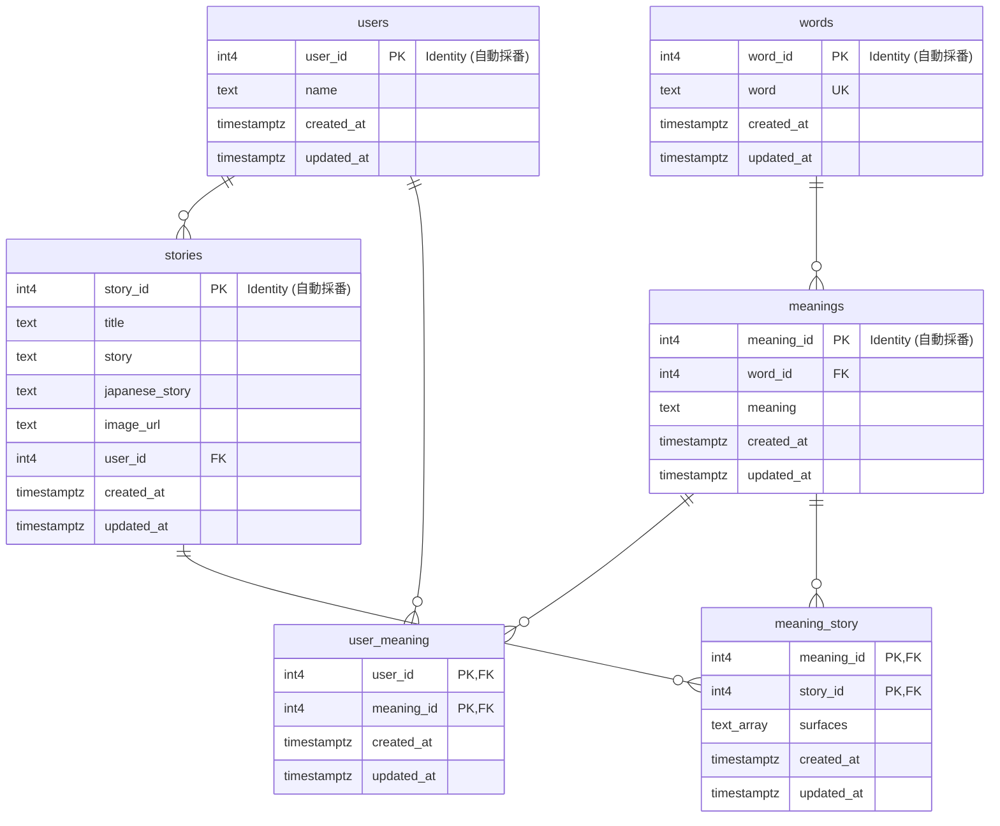

# データモデル定義書

本ドキュメントでは、単語帳アプリ（word-to-text-anki）における Supabase (PostgreSQL) データベースのテーブル定義およびリレーションシップについて定義します。

---

## 1. ER図 (Entity Relationship Diagram)

---

## 2. マスター系データ

### 2.1 `users`（ユーザー管理）

ユーザーの基本情報を管理するテーブルです。

| カラム名     | 型            | 制約                             | 説明       |
| ------------ | ------------- | -------------------------------- | ---------- |
| `user_id`    | `int4`        | Primary Key, Identity (自動採番) | ユーザーID |
| `name`       | `text`        |                                  | ユーザー名 |
| `created_at` | `timestamptz` | Default: `now()`                 | 作成日時   |
| `updated_at` | `timestamptz` | Default: `now()`                 | 更新日時   |

---

### 2.2 `words`（単語スペル管理）

単語のスペル（表記）を管理するテーブルです。重複登録を防ぐため `word` にユニーク制約を設定します。

| カラム名     | 型            | 制約                             | 説明                 |
| ------------ | ------------- | -------------------------------- | -------------------- |
| `word_id`    | `int4`        | Primary Key, Identity (自動採番) | 単語ID               |
| `word`       | `text`        | Unique, Not Null                 | 英単語・熟語のスペル |
| `created_at` | `timestamptz` | Default: `now()`                 | 作成日時             |
| `updated_at` | `timestamptz` | Default: `now()`                 | 更新日時             |

---

### 2.3 `meanings`（単語意味管理）

単語に対応する「意味」を管理するテーブルです。

| カラム名     | 型            | 制約                             | 説明       |
| ------------ | ------------- | -------------------------------- | ---------- |
| `meaning_id` | `int4`        | Primary Key, Identity (自動採番) | 意味ID     |
| `word_id`    | `int4`        | Foreign Key (`words.word_id`)    | 単語ID     |
| `meaning`    | `text`        | Not Null                         | 意味・定義 |
| `created_at` | `timestamptz` | Default: `now()`                 | 作成日時   |
| `updated_at` | `timestamptz` | Default: `now()`                 | 更新日時   |

---

### 2.4 `stories`（物語データ）

生成または登録された英文物語と和訳を管理するテーブルです。

| カラム名         | 型            | 制約                             | 説明                    |
| ---------------- | ------------- | -------------------------------- | ----------------------- |
| `story_id`       | `int4`        | Primary Key, Identity (自動採番) | 物語ID                  |
| `title`          | `text`        |                                  | 物語のタイトル          |
| `story`          | `text`        | Not Null                         | 英文本文                |
| `japanese_story` | `text`        |                                  | 和訳本文                |
| `image_url`      | `text`        |                                  | 生成された挿絵の画像URL |
| `user_id`        | `int4`        | Foreign Key (`users.user_id`)    | 作成したユーザーID      |
| `created_at`     | `timestamptz` | Default: `now()`                 | 作成日時                |
| `updated_at`     | `timestamptz` | Default: `now()`                 | 更新日時                |

---

## 3. リレーション系データ (中間テーブル)

### 3.1 `user_meaning`（ユーザー所有単語＋意味）

ユーザーが自分の単語帳に登録した「単語の意味」を管理します（旧 `lists`）。

| カラム名     | 型            | 制約                                             | 説明       |
| ------------ | ------------- | ------------------------------------------------ | ---------- |
| `user_id`    | `int4`        | Primary Key, Foreign Key (`users.user_id`)       | ユーザーID |
| `meaning_id` | `int4`        | Primary Key, Foreign Key (`meanings.meaning_id`) | 意味ID     |
| `created_at` | `timestamptz` | Default: `now()`                                 | 作成日時   |
| `updated_at` | `timestamptz` | Default: `now()`                                 | 更新日時   |

> **複合主キー**: `[user_id, meaning_id]`

---

### 3.2 `meaning_story`（物語包含意味）

物語の中にどの「単語の意味」が含まれているかと、物語中での実際の表記変化を管理します（旧 `word_story`）。

| カラム名     | 型            | 制約                                             | 説明                                       |
| ------------ | ------------- | ------------------------------------------------ | ------------------------------------------ |
| `meaning_id` | `int4`        | Primary Key, Foreign Key (`meanings.meaning_id`) | 意味ID                                     |
| `story_id`   | `int4`        | Primary Key, Foreign Key (`stories.story_id`)    | 物語ID                                     |
| `surfaces`   | `text[]`      |                                                  | 物語中での実際の使用形（例: `["jumped"]`） |
| `created_at` | `timestamptz` | Default: `now()`                                 | 作成日時                                   |
| `updated_at` | `timestamptz` | Default: `now()`                                 | 更新日時                                   |

> **複合主キー**: `[meaning_id, story_id]`
